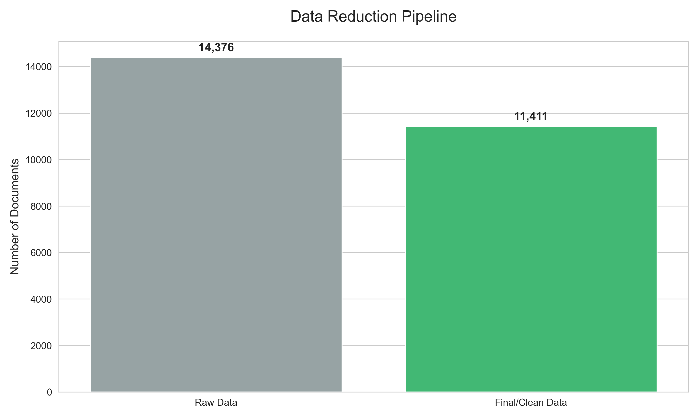
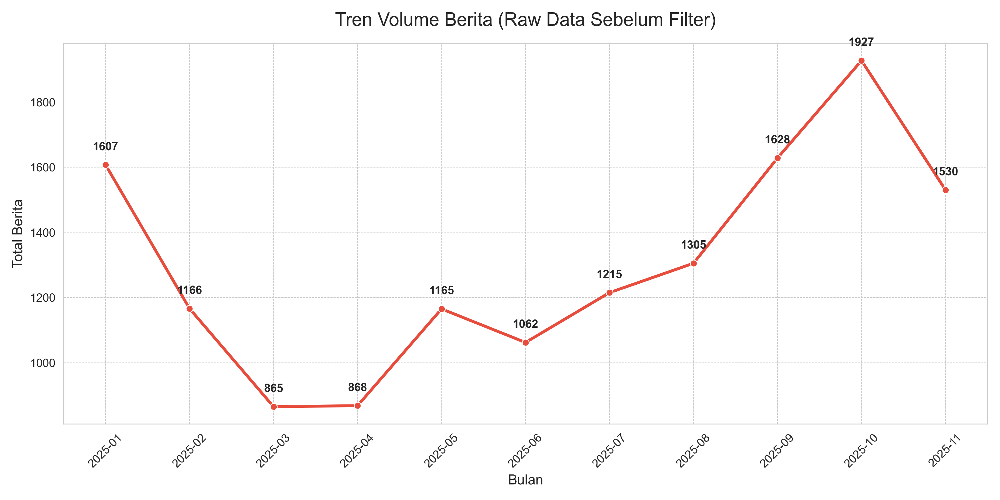

# Pemanfaatan NLP dalam Pengawasan Hukum Keamanan Pangan: Pendekatan PESTLE terkait Program Makan Bergizi Gratis (Paper Nomor 15)


> **Paper Nomor 15 - Tugas Besar MK ABDP**
> Penelitian ini mengusulkan pendekatan baru menggunakan model **Hybrid LDA-Guided BERTopic** untuk mendeteksi sinyal risiko hukum dan keamanan pangan pada Program Makan Bergizi Gratis (MBG).

---

## 📋 Daftar Isi
- Latar Belakang
- Studi Literatur
- Metodologi
- Arsitektur Model
- Evaluasi Model
- Eksperimen & Hasil
- Analisis PESTLE
- Instalasi

---

## 📖 Latar Belakang

<p align="justify"> Program Makan Bergizi Gratis (MBG) merupakan inisiatif strategis pemerintah Indonesia di bawah kepemimpinan Presiden Prabowo Subianto yang menargetkan peningkatan status gizi bagi lebih dari 82 juta penerima manfaat, termasuk anak sekolah, ibu hamil, dan balita. Hingga akhir tahun 2025, program ini telah menyerap anggaran negara sebesar Rp58 triliun dengan pembentukan 17.555 Satuan Pelayanan Pemenuhan Gizi (SPPG) di seluruh Indonesia. Skala implementasi yang masif ini membawa tantangan kompleks dalam aspek tata kelola dan pengawasan hukum. Rentetan insiden keamanan pangan, seperti kasus keracunan massal yang terjadi di beberapa daerah, serta risiko inheren penyimpangan dana dalam rantai pasok, menuntut mekanisme pengawasan yang lebih canggih daripada sekadar inspeksi fisik konvensional. Badan Gizi Nasional (BGN) sebagai regulator dihadapkan pada keterbatasan sumber daya manusia untuk memantau dinamika lapangan yang bergerak cepat secara real-time.
Di era digital, diskursus publik di media daring berfungsi sebagai sensor sosial yang efektif dalam mendeteksi anomali kebijakan. Namun, volume data berita yang sangat besar dan tidak terstruktur membuat analisis manual menjadi tidak efisien. Di sinilah peran teknologi Natural Language Processing (NLP) menjadi krusial. Penelitian terdahulu telah banyak mengeksplorasi penggunaan NLP untuk analisis kebijakan publik. Studi oleh Abdurrohim & Rahman (2024) menggunakan Sentiment Analysis untuk mengevaluasi respons masyarakat terhadap Omnibus Law, sementara riset lain memanfaatkan Machine Learning untuk klasifikasi dokumen hukum secara otomatis. Namun, mayoritas penelitian tersebut (State of the Art) masih didominasi oleh pendekatan analisis sentimen berbasis leksikon atau model topik konvensional seperti Latent Dirichlet Allocation (LDA) yang sering kali menghasilkan topik yang ambigu dan tumpang tindih (overlapping) pada korpus berbahasa Indonesia.
Kesenjangan penelitian (research gap) terlihat pada minimnya studi yang mengintegrasikan model bahasa modern berbasis Transformer dengan kerangka pengawasan hukum preventif, khususnya dalam konteks keamanan pangan di Indonesia. Model LDA klasik memiliki keterbatasan dalam menangkap konteks semantik yang kompleks, sementara model Deep Learning murni sering kali membutuhkan komputasi berat dan sulit diinterpretasikan (black box). Belum ada penelitian yang secara spesifik menerapkan arsitektur hibrida untuk memetakan potensi pelanggaran hukum dalam program nasional berskala besar seperti MBG.
Untuk menjembatani kesenjangan tersebut, penelitian ini mengusulkan pendekatan baru menggunakan model Hybrid LDA-Guided BERTopic. Model ini menggabungkan interpretabilitas struktur topik global dari LDA dengan akurasi representasi semantik lokal dari model embedding khusus domain pemerintahan (IndoGovBERT). Pendekatan ini dirancang untuk mendeteksi sinyal lemah (weak signals) terkait isu hukum—seperti pola pemberitaan keracunan berulang atau indikasi korupsi yayasan—yang sering luput dari pengawasan makro.
Tujuan utama dari penelitian ini adalah mendemonstrasikan efektivitas arsitektur hibrida dalam mengekstraksi intelijen hukum dari data teks berita, serta memetakan isu-isu tersebut menggunakan kerangka kerja PESTLE (Political, Economic, Social, Technological, Legal, Environmental). Kontribusi utama penelitian ini terletak pada pengembangan metodologi pengawasan berbasis data (data-driven surveillance) yang dapat diadopsi oleh regulator untuk mendeteksi risiko hukum dan keamanan pangan secara dini, sehingga memungkinkan respons kebijakan yang lebih cepat dan terukur. </p>

---

## 📖 Studi Literatur

### 1. Pengawasan Hukum Keamanan Pangan dalam Program Publik
<p align="justify">Keamanan pangan merupakan aspek fundamental dalam penyelenggaraan program publik yang berorientasi pada pemenuhan kebutuhan dasar masyarakat. Dalam konteks Indonesia, keamanan pangan tidak hanya berkaitan dengan kualitas dan kelayakan konsumsi makanan, tetapi juga mencakup aspek hukum, tata kelola, dan pertanggungjawaban negara terhadap risiko kesehatan masyarakat. Undang-Undang Nomor 18 Tahun 2012 tentang Pangan menegaskan bahwa negara memiliki kewajiban untuk menjamin keamanan, mutu, dan gizi pangan yang dikonsumsi oleh masyarakat.
Program Makan Bergizi Gratis (MBG) sebagai program nasional berskala besar menghadirkan tantangan pengawasan yang kompleks. Skala distribusi yang masif, keterlibatan banyak pihak (pemerintah pusat, daerah, mitra swasta, dan UMKM), serta keterbatasan sumber daya pengawas lapangan meningkatkan potensi terjadinya pelanggaran keamanan pangan dan penyimpangan tata kelola. Dalam kondisi tersebut, pendekatan pengawasan konvensional yang mengandalkan inspeksi fisik dan laporan manual menjadi kurang memadai untuk mendeteksi risiko secara dini.
Literatur terkini menekankan pentingnya pendekatan pengawasan preventif (preventive surveillance), yaitu mekanisme yang mampu mengidentifikasi indikasi awal pelanggaran sebelum berdampak luas [1]. Dalam konteks ini, data digital—khususnya berita daring dan diskursus publik—dapat berfungsi sebagai indikator awal (early signals) terhadap permasalahan keamanan pangan dan hukum yang muncul di lapangan.</p>

### 2. Natural Language Processing (NLP) dalam Analisis Kebijakan Publik
<p align="justify">Natural Language Processing (NLP) merupakan cabang kecerdasan buatan yang berfokus pada pemrosesan dan pemahaman bahasa manusia dalam bentuk teks [2]. Dalam beberapa tahun terakhir, NLP telah banyak digunakan dalam kajian kebijakan publik untuk menganalisis opini masyarakat, framing media, serta dinamika wacana politik dan hukum.
Penelitian oleh Abdurrohim dan Rahman (2024) menunjukkan bahwa analisis sentimen berbasis NLP mampu mengungkap respons publik terhadap kebijakan kontroversial seperti Omnibus Law [3]. Studi lain memanfaatkan teknik klasifikasi teks untuk mengelompokkan dokumen hukum dan peraturan secara otomatis [4]. Namun, sebagian besar penelitian tersebut masih berfokus pada analisis sentimen atau klasifikasi supervised, yang membutuhkan label manual dan sering kali tidak mampu menangkap kompleksitas isu kebijakan yang bersifat multidimensional.
Dalam konteks pengawasan kebijakan publik, pendekatan unsupervised seperti topic modeling menjadi relevan karena mampu mengidentifikasi pola isu tanpa pelabelan awal. Dengan demikian, NLP berpotensi menjadi alat strategis untuk mengekstraksi wawasan kebijakan (policy intelligence) dari data teks berskala besar secara efisien.</p>

### 3. Topic Modeling: Latent Dirichlet Allocation (LDA)
<p align="justify">Latent Dirichlet Allocation (LDA) merupakan algoritma topic modeling probabilistik yang paling banyak digunakan dalam analisis teks [5]. LDA memodelkan setiap dokumen sebagai campuran beberapa topik, dan setiap topik sebagai distribusi probabilitas kata. Keunggulan utama LDA terletak pada kesederhanaan, interpretabilitas, serta kemampuannya dalam menangkap struktur topik global dalam korpus teks [6].
Sejumlah penelitian menggunakan LDA untuk menganalisis dokumen kebijakan, laporan pemerintah, dan berita daring [7, 8, 9]. Namun, literatur juga mencatat beberapa keterbatasan LDA, terutama dalam korpus berbahasa Indonesia. LDA sangat bergantung pada frekuensi kemunculan kata dan tidak mempertimbangkan konteks semantik [7], sehingga sering menghasilkan topik yang ambigu, tumpang tindih, atau sulit diinterpretasikan ketika kata-kata kunci tidak muncul secara berdampingan [10].
Keterbatasan ini menjadi semakin signifikan ketika LDA digunakan untuk menganalisis isu kebijakan publik yang kompleks, di mana makna sering kali tersirat dalam struktur kalimat dan hubungan antar kata, bukan sekadar ko-eksistensi kata. </p>

### 4. Model Bahasa Berbasis Transformer dan BERTopic
<p align="justify">Perkembangan model bahasa berbasis Transformer, seperti BERT, telah membawa lompatan besar dalam pemrosesan bahasa alami. Model ini menggunakan mekanisme self-attention untuk memahami hubungan kontekstual antar kata dalam sebuah kalimat, sehingga mampu menangkap makna yang lebih dalam dibandingkan pendekatan berbasis frekuensi [11, 12].
BERTopic merupakan framework topic modeling modern yang menggabungkan embedding kontekstual berbasis Transformer dengan teknik reduksi dimensi (UMAP) dan klasterisasi berbasis densitas (HDBSCAN). Pendekatan ini memungkinkan pembentukan topik yang lebih koheren secara semantik dan adaptif terhadap variasi struktur teks [13].
Penelitian terdahulu menunjukkan bahwa BERTopic unggul dalam menangkap topik yang lebih bermakna pada data teks kompleks. Namun, literatur juga mencatat kelemahan BERTopic, yaitu ketidakstabilan jumlah topik dan kecenderungan menghasilkan terlalu banyak klaster kecil, terutama ketika diterapkan tanpa kontrol struktural yang memadai. </p>

### 5. Model Bahasa Spesifik Domain: IndoGovBERT
<p align="justify">Model bahasa spesifik domain dikembangkan untuk meningkatkan performa NLP pada konteks tertentu. IndoGovBERT merupakan model Transformer yang dilatih dan di-fine-tune pada korpus pemerintahan dan kebijakan publik Indonesia [14]. Dengan demikian, model ini memiliki sensitivitas yang lebih baik terhadap istilah birokrasi, regulasi, anggaran, dan tata kelola pemerintahan [15].
Literatur menunjukkan bahwa domain-specific language models mampu meningkatkan kualitas representasi semantik dibandingkan model bahasa umum ketika diaplikasikan pada domain yang sesuai [16]. Dalam konteks analisis kebijakan publik dan pengawasan hukum, IndoGovBERT menawarkan keunggulan dalam memahami nuansa terminologi hukum dan administratif yang sering kali tidak tertangkap oleh model bahasa umum.

### 6. Pendekatan Hybrid dalam Topic Modeling
<p align="justify">Pendekatan hybrid dalam topic modeling muncul sebagai respons terhadap keterbatasan model tunggal [9]. Model probabilistik seperti LDA unggul dalam stabilitas struktur topik [7, 8], sementara model berbasis Transformer unggul dalam pemahaman semantik [11, 12]. Integrasi kedua pendekatan ini bertujuan untuk memperoleh the best of both worlds.
Beberapa penelitian telah mengeksplorasi pendekatan semi-supervised atau guided topic modeling, di mana hasil model statistik digunakan untuk membimbing proses klasterisasi berbasis embedding [17]. Pendekatan ini terbukti mampu meningkatkan koherensi topik sekaligus menjaga konsistensi jumlah topik.
Namun, penerapan arsitektur hybrid dalam konteks pengawasan hukum keamanan pangan, khususnya pada program nasional di Indonesia, masih sangat terbatas. Hal ini menunjukkan adanya peluang penelitian yang signifikan untuk mengembangkan metodologi pengawasan berbasis data teks.

### 7. Kerangka Analisis PESTLE dalam Evaluasi Kebijakan
<p align="justify">PESTLE merupakan kerangka analisis strategis yang digunakan untuk mengevaluasi faktor eksternal yang memengaruhi kebijakan atau organisasi, meliputi aspek Political, Economic, Social, Technological, Legal, dan Environmental [18]. Kerangka ini banyak digunakan dalam studi kebijakan dan analisis bisnis karena mampu memberikan pandangan holistik terhadap risiko dan peluang.
Dalam penelitian ini, PESTLE digunakan sebagai lensa interpretatif untuk memetakan topik hasil modeling ke dalam dimensi kebijakan yang relevan. Integrasi topic modeling dengan kerangka PESTLE memungkinkan analisis isu kebijakan secara sistematis dan berbasis data, sehingga mendukung pengambilan keputusan yang lebih terstruktur. </p>

### 8. Research Gap dan Posisi Penelitian
<p align="justify">Berdasarkan tinjauan literatur, terdapat beberapa kesenjangan penelitian yang dapat diidentifikasi. Pertama, sebagian besar studi NLP dalam kebijakan publik masih berfokus pada analisis sentimen atau model topik konvensional yang kurang mampu menangkap konteks semantik yang kompleks [9, 10, 19]. Kedua, pemanfaatan model bahasa modern berbasis Transformer dalam pengawasan hukum keamanan pangan masih sangat terbatas [4, 20]. Ketiga, belum banyak penelitian yang mengintegrasikan pendekatan hybrid topic modeling dengan kerangka analisis strategis seperti PESTLE [13, 21].
Penelitian ini memposisikan diri untuk mengisi kesenjangan tersebut dengan mengusulkan pendekatan Hybrid LDA-Guided BERTopic berbasis IndoGovBERT untuk analisis isu Program Makan Bergizi Gratis. Dengan demikian, penelitian ini berkontribusi pada pengembangan metodologi pengawasan kebijakan publik berbasis NLP yang bersifat preventif, interpretatif, dan relevan secara kontekstual.</p>

---

## 🔬 Metodologi

<p align="justify">Penelitian ini menerapkan pendekatan kuantitatif berbasis Natural Language Processing (NLP) untuk menganalisis diskursus publik dan aspek hukum terkait Program Makan Bergizi Gratis (MBG). Kerangka kerja penelitian dirancang secara sistematis melalui lima tahapan utama: 
(1) Pengumpulan Data (Data Collection) → (2) Pra-pemrosesan Teks (Text Preprocessing) → (3) Desain Eksperimen Model (Model Experiment Design) → (4) Evaluasi Kinerja Model → (5) Analisis PESTLE. Alur kerja secara keseluruhan diilustrasikan sebagai rangkaian eksperimen komparatif yang membandingkan model probabilistik, model berbasis transformer, dan model hibrida untuk menentukan arsitektur optimal.</p>

### 1. Pengumpulan Data
* **Sumber:** Google News (Agregasi media nasional dan lokal).
* **Periode:** 6 Januari 2025 – 30 November 2025.
* **Teknik:** Web Scraping (Selenium & Newspaper3k).
* **Kata Kunci:** 40 variasi kata kunci berbasis kerangka kerja PESTLE (misal: "Badan Gizi Nasional", "Isu Keracunan Makan Siang Gratis", "BPOM Pengawasan Makanan Sekolah", "BPOM Pengawasan Makanan Sekolah" dan lainnya).
* **Volume Data:** hasil dari scraping data, total 14.376 data artikel mentah yang disimpan dalam format csv.

### 2. Preprocessing
Tahap ini bertujuan untuk membersihkan noise tanpa menghilangkan struktur semantik yang dibutuhkan oleh model Deep Learning. Strategi yang digunakan adalah "Light Cleaning" dengan langkah-langkah sebagai berikut:
1. **Filtering & Deduplikasi:** Menghapus data dengan status scrape gagal dan menghapus artikel duplikat yang memiliki konten persis sama
2. **Pembersihan Karakter:** Mengubah teks menjadi huruf kecil (lowercase), menghapus URL, tag HTML, alamat surel, karakter non-ASCII dan penanganan stopwords khusus (mempertahankan kata sambung untuk embedding).
3. **Normalisasi Tanggal Relatif:** Mengonversi referensi waktu relatif (contoh: "kemarin", "2 jam lalu") menjadi format tanggal absolut (YYYY-MM-DD) untuk validitas analisis tren.
4. **Penanganan Stopwords (Strategi Khusus):**
    * Untuk tahap vektorisasi (Vectorizer), digunakan daftar stopwords bahasa Indonesia yang diperluas (termasuk kata-kata navigasi web seperti "baca juga", "halaman").
    * Namun, untuk tahap Embedding, struktur kalimat (termasuk kata sambung) dipertahankan agar model BERT dapat memahami konteks semantik secara utuh.
      
Pada Preprocessing tidak dilakukan stemming agar menjaga makna dari kata tersebut. Setelah proses ini, dataset final artikel berita valid dan siap digunakan untuk pemodelan topik.

---

## 🤖 Arsitektur Model

Penelitian ini menggunakan pendekatan eksperimental komparatif untuk menentukan algoritma topic modeling yang paling efektif. Tiga kategori arsitektur model diuji dengan spesifikasi teknis sebagai berikut:

### 1. Model Probabilistik: Latent Dirichlet Allocation (LDA)
Sebagai baseline tradisional, algoritma LDA digunakan untuk memodelkan topik berdasarkan distribusi probabilitas kata dalam dokumen. Implementasi menggunakan pustaka Gensim dengan konfigurasi hyperparameters berikut untuk memastikan konvergensi model: chunksize=2000, passes=20, serta alpha='auto' dan eta='auto' untuk optimasi distribusi prior secara otomatis. Dua variasi ekstraksi fitur diuji:
* **LDA Unigram:** Menggunakan representasi kata tunggal (single word tokens).
* **LDA Bigram:** Menggunakan representasi frasa dua kata (phrases) yang dibentuk menggunakan modul gensim.models.Phrases (threshold=50) untuk menangkap konteks lokal seperti "badan_gizi" atau "makan_gratis".

### 2. Model Berbasis Transformer (BERTopic)
Eksperimen kedua menerapkan BERTopic, sebuah arsitektur modular yang menggabungkan embedding kontekstual dengan teknik klasterisasi. Arsitektur BERTopic yang dibangun terdiri dari komponen berikut:
* **Reduksi Dimensi (UMAP):** Mengompresi vektor embedding menjadi 5 komponen (n_components=5) dengan metrik cosine distance dan n_neighbors=15 untuk mempertahankan struktur lokal data.
* **Klasterisasi (HDBSCAN):** Mengelompokkan dokumen berdasarkan densitas vektor dengan parameter min_cluster_size=15 dan metrik euclidean.
* **Representasi Topik (c-TF-IDF):** Mengekstrak kata kunci yang membedakan satu klaster dengan klaster lainnya menggunakan Class-based TF-IDF.

Tiga variasi model pre-trained embedding dibandingkan:
* `IndoBERT (indolem/indobert-base-uncased)`: Base model bahasa Indonesia umum sebagai baseline monolingual.
* `IndoGovBERT (just-108/IndoGovBERT-Wirawans-FT-C3)`: Model yang telah dilatih ulang (finetuned) khusus pada korpus pemerintahan dan kebijakan publik Indonesia.
* `Multilingual-MiniLM (sentence-transformers/paraphrase-multilingual-MiniLM-L12-v2)`: Model multibahasa standar untuk perbandingan skala global.

### Model Hybrid (LDA-BERTopic)
Penelitian ini mengusulkan arsitektur hibrida Semi-Supervised untuk menggabungkan keunggulan struktur global LDA dengan akurasi semantik lokal BERTopic. Mekanisme arsitektur:
1.  **Guiding Phase:** LDA dijalankan terlebih dahulu untuk menghasilkan label topik kasar (coarse-grained topic labels) bagi setiap dokumen.
2.  **Injection Phase:** Label prediksi LDA disuntikkan ke dalam pipeline BERTopic (fit_transform(docs, y=lda_labels)).
3.  **Representasi Akhir:** BERTopic menggunakan label tersebut untuk memandu proses reduksi dimensi UMAP, sehingga klaster yang terbentuk selaras dengan distribusi probabilitas LDA namun tetap diperkaya oleh representasi semantik dari embedding IndoGovBERT

Dua Skenario uji:
1.  **Hybrid Unigram:** Menggunakan LDA Unigram sebagai pemandu BERTopic dengan embedding IndoGovBERT.
2.  **Hybrid Bigram:** Menggunakan LDA Bigram sebagai pemandu BERTopic dengan embedding IndoGovBERT.

---
## 📝 Evaluasi Model

Kualitas topik dari ketujuh variasi eksperimen di atas dievaluasi menggunakan tiga metrik kuantitatif utama:

### 1. Coherence NPMI (Normalized Pointwise Mutual Information)
Mengukur koherensi semantik antar kata kunci dalam satu topik (skor mendekati 1.0 mengindikasikan koherensi sempurna).

### 2. Coherence Score
Mengukur korelasi topik menggunakan pendekatan sliding window (standar evaluasi Gensim).

### 3.	Topic Diversity
Mengukur persentase kata unik di seluruh topik untuk memastikan model tidak menghasilkan topik yang repetitif.

---

## 📊 Eksperimen & Hasil

### Statistik Deskriptif Data
Pengumpulan data berita dilakukan secara periodik mulai tanggal 6 Januari 2025 hingga 30 November 2025 menggunakan teknik web scraping. Proses akuisisi data ini menghasilkan total 14.376 artikel mentah yang bersumber dari berbagai portal berita nasional dan daerah yang terindeks di Google News.
Setelah melalui tahapan pra-pemrosesan (preprocessing) yang ketat, jumlah dokumen valid yang siap untuk dimodelkan adalah 11.411 dokumen


*Gambar 1: Visualisasi Pipeline Reduksi Data (Raw vs Clean)*

*Tabel 1: Statistik Deskriptif Data*
| Tahapan Data | Jumlah Artikel | Keterangan |
| :--- | :--- | :---|
| Data Mentah (Raw)	| 14.376	| Hasil scraping awal inklusif duplikasi & error. |
| Data Bersih (Clean)	| 11.411 |	Setelah deduplikasi dan filter konten pendek. |
| Total Reduksi |	2.965 (~20,6%) |	Dokumen yang dihapus (duplikat/tidak relevan). |



*Gambar 2: Tren Data*

Distribusi data menunjukkan tren peningkatan volume berita yang signifikan mendekati bulan Oktober dan November 2025, yang bertepatan dengan momentum implementasi penuh program. Hal ini mengindikasikan bahwa diskursus publik mengenai program Makan Bergizi Gratis (MBG) semakin intensif seiring berjalannya waktu.

### Hasil Preprocessing
Kualitas model topik sangat bergantung pada kebersihan data input. Tahap preprocessing bertujuan untuk menghilangkan noise (seperti tanggal, nama wartawan, iklan) tanpa merusak struktur kalimat yang dibutuhkan oleh model BERT. Tabel 4.2 memperlihatkan perbandingan sampel teks sebelum dan sesudah diproses.
| Sampel | Raw Data |	Hasil Preprocessing |
| :--- | :--- | :---|
| Sampel 1 |	"Bloomberg Technoz, Jakarta - Badan Pangan Nasional (Bapanas) menyebut tengah berkolaborasi dengan pemerintah Denmark untuk mengembangkan kampanye stop boros pangan..."	| "bloomberg technoz badan pangan nasional bapanas menyebut tengah berkolaborasi dengan pemerintah denmark untuk mengembangkan kampanye stop boros pangan..." |
| Sampel 2 |	"Wamen LH Tinjau SPPG Halim: Gizi Anak Terpenuhi... Jakarta, 19 September 2025 — Program Makanan Bergizi Gratis (MBG) bukan hanya memastikan gizi..." |	"wamen lh tinjau sppg halim gizi anak terpenuhi sampah terkelola nomor sr humas klh bplh september program makanan bergizi gratis mbg bukan hanya memastikan gizi..." |
| Sampel 3 |	"KBRN, Malinau : Pelaksanaan perdana... dimulai pada Senin (24/11/2025). Sebanyak 427 siswa tercatat..." |	"kbrn malinau pelaksanaan perdana program makan bergizi gratis mbg di smpn malinau oleh satuan pelayanan pemenuhan gizi sppg muhammadiyah dimulai pada sebanyak siswa tercatat..." |

Perubahan signifikan terlihat pada penghapusan karakter khusus, standardisasi huruf menjadi lowercase, dan penghapusan angka tanggal yang tidak relevan secara semantik, namun tetap mempertahankan kata sambung (seperti "dan", "untuk") guna menjaga konteks bagi model embedding

### Hasil Evaluasi Topic Modeling

| Kategori Model	| Variasi Arsitektur	| Coherence (NPMI)	| Coherence (Cv)	| Topic Diversity |
| :--- | :--- | :--- |:--- | :--- |
| Probabilistik	| LDA Unigram (Baseline) |	0.0670 |	0.5574 |	0.6120 |
|  |	LDA Bigram |	0.0511 |	0.5077 |	0.5800 |
| Transformer	| BERTopic (IndoBERT Base) |	0.1324 |	0.6531	| 0.6467 |
|  |	BERTopic (Multilingual-MiniLM)	| 0.1104	| 0.6131	| 0.6255 |
|  |	BERTopic (IndoGovBERT)	| 0.1392	| 0.6566	| 0.6194 |
| Hibrida	| Hybrid LDA-BERTopic (Bigram) |	0.1318	| 0.6488 |	0.6266|
|  |	**Hybrid LDA-BERTopic (Unigram)**	| **0.1455** |	**0.6644**	| **0.6944** |

Berdasarkan data kuantitatif pada Tabel tersebut serta peninjauan kualitatif terhadap topik yang dihasilkan, terdapat beberapa temuan krusial yang menjelaskan perilaku setiap arsitektur model terhadap korpus berita kebijakan publik:

#### 1. Superioritas Representasi Kontekstual (Contextual Embedding):
Seluruh variasi model berbasis Transformer (BERTopic) secara konsisten mengungguli model probabilistik tradisional (LDA). Skor NPMI rata-rata BERTopic berada di atas 0.11, sedangkan LDA tertahan di bawah 0.07.
* Analisis Kualitatif: Kelemahan LDA terlihat pada ketidakmampuannya menangkap sinonim atau konteks yang terpisah jauh dalam kalimat. Sebagai contoh, LDA cenderung memisahkan kata "makan" dan "gizi" ke dalam topik berbeda jika tidak muncul berdampingan. Sebaliknya, BERTopic yang menggunakan attention mechanism mampu memahami bahwa kedua kata tersebut merujuk pada entitas program yang sama meskipun terpisah oleh kata lain, menghasilkan topik yang lebih padat dan bermakna.

#### 2.	Efektivitas Domain-Specific Fine-tuning (IndoGovBERT):
Di antara variasi model embedding, IndoGovBERT mencatat skor NPMI tertinggi (0.1392) dibandingkan model bahasa umum.
* Analisis Kualitatif: Perbedaan signifikan terlihat pada sensitivitas terhadap istilah teknis. Model IndoBERT standar cenderung mengelompokkan kata "dana" dengan kata umum seperti "uang" atau "bayar". Namun, IndoGovBERT berhasil mengasosiasikan "dana" dengan istilah birokrasi spesifik seperti "anggaran", "realisasi", dan "serapan". Hal ini membuktikan bahwa fine-tuning pada korpus pemerintahan memberikan "pemahaman" yang lebih baik terhadap nuansa tata kelola kebijakan.

#### 3.	Sinergi Arsitektur Hibrida (The Best of Both Worlds):
Model usulan Hybrid LDA-BERTopic (Unigram) mencapai kinerja puncak (NPMI 0.1455). Peningkatan ini bukan kebetulan statistik, melainkan hasil sinergi struktural.
* Mekanisme: LDA bekerja sangat baik dalam memetakan struktur global (membedakan topik ekonomi vs. kesehatan secara kasar). Ketika label kasar ini disuntikkan ke BERTopic, model Deep Learning tidak perlu lagi "menebak" dari nol, melainkan hanya perlu memperhalus representasi tersebut. Hasilnya adalah topik yang tajam (seperti LDA) namun kaya nuansa semantik (seperti BERT).

#### 4.	Anomali Bigram pada Arsitektur Hibrida:
Variasi Hybrid Unigram justru berkinerja lebih baik daripada Hybrid Bigram.
* Analisis: Model BERT dilatih untuk membaca kalimat alami. Pemaksaan tokenisasi menjadi frasa kaku (bigram seperti "makan_bergizi" atau "badan_gizi") justru merusak struktur kalimat yang dipelajari oleh tokenizer BERT. Akibatnya, model kehilangan konteks kalimat utuh, yang menyebabkan penurunan kualitas representasi vektor.

### Analisis Topik Model Terbaik

Berdasarkan evaluasi komparatif di atas, model Hybrid Unigram ditetapkan sebagai model terbaik. Analisis mendalam terhadap 25 topik yang dihasilkan menunjukkan bahwa model ini memiliki karakteristik unik yang tidak ditemukan pada model lain, yaitu kemampuan menyeimbangkan antara Isu Makro (Dominan) dan Isu Mikro (Spesifik).


*Gambar 3: Intertopic Distance Map LDA-BERTopic Unigram*

#### Struktur Distribusi Topik
Visualisasi Intertopic Distance Map dan distribusi dokumen memperlihatkan tiga klaster fenomena utama:

1. **Klaster Isu Dominan**
Didominasi oleh Topik #0, #1, dan #2 yang mencakup lebih dari 30% total berita. Kata kunci seperti "program, gizi, triliun, anggaran, dadan" menunjukkan bahwa diskursus utama media masih berpusat pada sosialisasi program dan besaran fiskal. Model berhasil menangkap bahwa ini adalah "wajah utama" dari pemberitaan.

2. **Klaster Isu Spesifik/Insidental:**
Keunggulan utama model Hybrid terlihat di sini. Model mampu mengisolasi event spesifik menjadi topik mandiri, terpisah dari isu umum:
  * **Topik #6 (Keracunan):** Memisahkan insiden keracunan dari topik kesehatan umum.
  * **Topik #58 (Diplomasi Internasional):** Secara presisi menangkap kata kunci "Brasil, Lula, G20" yang merujuk pada studi banding program pangan, sebuah nuansa yang gagal ditangkap oleh LDA murni.

3. **Klaster Deteksi Anomali:**
Model berhasil mengidentifikasi pola yang mengindikasikan penyimpangan. Topik #12 secara konsisten mengelompokkan kata "yayasan, ira, mitra, kalibata" yang merujuk pada kasus spesifik dugaan penyelewengan dana. Kemampuan model memisahkan ini dari topik korupsi umum (Topik #15) menunjukkan tingkat granularitas yang sangat tinggi.

---

## ⚖️ Analisis PESTLE Model Terbaik Secara Kuantitatif (LDA-BERTopic Unigram)

Berdasarkan model terbaik, ditemukan isu-isu krusial yang dipetakan ke dalam kerangka PESTLE:

### 1. Legal (Hukum)
Model berhasil mendeteksi entitas hukum dan kasus spesifik yang luput dari pengamatan manual, yang terefleksi dalam topik-topik berikut:
* **Topik #15 (Penegakan Hukum):** Topik ini didominasi kata kunci "korupsi, kpk, tersangka, pidana, pengadilan, hakim". Ini merepresentasikan diskursus mengenai proses litigasi dan penindakan hukum terhadap penyelewengan dana
* **Topik #12 (Kasus Spesifik Yayasan):** Munculnya klaster topik dengan kata kunci "yayasan, ira, mitra, kalibata, dana, penggelapan" mengindikasikan kemampuan model mendeteksi kasus spesifik dugaan penyalahgunaan wewenang oleh mitra penyedia.
  
**Implikasi Hukum:** Temuan ini menunjukkan bahwa NLP dapat difungsikan sebagai sistem peringatan dini (early warning system) bagi aparat penegak hukum. Tingginya frekuensi kata "tersangka" dan "pidana" menuntut penguatan regulasi pengawasan dana hibah/mitra swasta untuk mencegah kerugian negara.

### 2. Social (Sosial)
Dimensi sosial didominasi oleh isu krusial mengenai keselamatan penerima manfaat:
* **Topik #6 & #7 (Insiden Keracunan):** Kata kunci "keracunan, korban, siswa, sakit, muntah, puskesmas, gejala" membentuk klaster yang sangat padat.
* **#10 (Gizi & Stunting):** Fokus pada tujuan jangka panjang program, yaitu penanganan "stunting, gizi, pertumbuhan, anak".
 
**Implikasi Hukum:** Dominasi topik keracunan (Topik #6) menggarisbawahi urgensi penerapan prinsip pertanggungjawaban mutlak (strict liability) dalam UU Pangan bagi vendor penyedia. Diperlukan regulasi teknis yang mewajibkan uji sampel makanan harian sebelum distribusi.

### 3. Economic (Ekonomi)
* **Topik #1 & #9 (Makro Ekonomi):** Membahas "triliun, anggaran, apbn, belanja negara", menyoroti besarnya skala fiskal program.
* **Topik #8 & #29 (Ekonomi Mikro):** Membahas "umkm, koperasi, pembiayaan, kredit, bank, bri". Menunjukkan bahwa program ini telah terintegrasi dengan ekosistem perbankan untuk permodalan vendor kecil.

**Implikasi Hukum:** Pengawasan hukum tidak boleh hanya terpaku pada kualitas makanan, tetapi juga pada mekanisme kontrak pengadaan barang dan jasa (PBJ) untuk mencegah praktik monopoli atau kartel vendor besar yang mematikan UMKM.

### 4. Technological (Teknologi)
* **Topik #21 & #53:** Munculnya kata kunci "aplikasi, digital, sistem, gopay, saldo, teknologi" menunjukkan adanya adopsi teknologi finansial (fintech) dalam distribusi bantuan

**Implikasi Hukum:** Pemanfaatan jejak digital (digital footprint) dalam aplikasi pembayaran dapat dijadikan alat bukti audit forensik yang sah untuk memverifikasi ketercepatan dan ketepatan penerimaan manfaat, mengurangi risiko manipulasi data manual.

### 5. Environmental (Lingkungan)
* **Topik #17:** Kata kunci "sampah, limbah, sisa, organik, food waste" membentuk klaster yang jelas dan terpisah.
  
**Implikasi Hukum:** Belum adanya regulasi spesifik mengenai pengelolaan limbah sisa makanan (food loss and waste) dalam skala masif program MBG menjadi celah hukum (vacuum of norm). Diperlukan aturan turunan yang mewajibkan vendor memiliki protokol pengelolaan limbah organik.

### 6. Politik
* **Topik #58:** Mendeteksi kata kunci "brasil, lula, prabowo, g20", yang merefleksikan studi banding kebijakan atau diplomasi internasional terkait program pangan global.

### Rangkuman Temuan Strategis
Penerapan Hybrid Topic Modeling terbukti mampu mengurai kompleksitas isu Program Makan Bergizi Gratis dengan tingkat akurasi yang tinggi. Dari perspektif hukum keamanan pangan, temuan paling krusial adalah kemampuan model mendeteksi pola insiden keracunan berulang (Topik #6) dan anomali pengelolaan dana yayasan (Topik #12) secara otomatis tanpa intervensi manusia.
Hal ini menegaskan bahwa pendekatan komputasional dapat menjadi instrumen pendukung (supporting instrument) yang valid bagi Badan Gizi Nasional maupun aparat penegak hukum dalam melakukan pengawasan preventif, melengkapi metode pengawasan konvensional yang ada saat ini.

---

## 📚 Referensi
[1] A. Suadi, Sistem Pengawasan Badan Peradilan di Indonesia, vol. 1. Depok: Rajawali Pers, 2014. Accessed: Dec. 18, 2025. [Online]. Available: https://www.google.co.id/books/edition/Sistem_Pengawasan_Badan_Peradilan_di_Ind/R_cbEAAAQBAJ?hl=id&gbpv=1&dq=pengawasan+preventif+yaitu&pg=PA21&printsec=frontcover
[2] W. Budiharto, D. Suhartono, and V. Andreas, DEEP LEARNING : Konsep dan Penerapannya, 1st ed. Yogyakarta: Penerbit ANDI, 2025. Accessed: Dec. 18, 2025. [Online]. Available: https://books.google.co.id/books?id=B9CcEQAAQBAJ&newbks=0&printsec=frontcover&pg=PA129&dq=Natural+Language+Processing+(NLP)+merupakan&hl=id&source=newbks_fb&redir_esc=y#v=onepage&q=Natural%20Language%20Processing%20(NLP)%20merupakan&f=false
[3] I. Abdurrohim and A. Rahman, “PENERAPAN NATURAL LANGUAGE PROCESSING UNTUK ANALISIS SENTIMEN TERHADAP KEBIJAKAN PEMERINTAH,” JURNAL KEBANGSAAN RI, vol. 1, no. 2, pp. 55–60, May 2024, doi: 10.31848/JKRI.V1I2.3403.
[4] I. Chalkidis, I. Androutsopoulos, and N. Aletras, “Neural Legal Judgment Prediction in English,” ACL 2019 - 57th Annual Meeting of the Association for Computational Linguistics, Proceedings of the Conference, pp. 4317–4323, June 2019, doi: 10.18653/v1/p19-1424.
[5] A. Nugroho, DATA SCIENCE MENGGUNAKAN BAHASA R, 1st ed. Yogyakarta: Penerbit ANDI, 2022.
[6] A. Permana, Computational Intelligence, 1st ed. EduGorilla Community Pvt. Ltd., 2008. Accessed: Dec. 18, 2025. [Online]. Available: https://www.google.co.id/books/edition/Computational_Intelligence/SgiSEQAAQBAJ?hl=id&gbpv=0
[7] D. M. Blei, A. Y. Ng, and J. B. Edu, “Latent Dirichlet Allocation Michael I. Jordan,” Journal of Machine Learning Research, vol. 3, pp. 993–1022, 2003.
[8] M. E. Roberts et al., “Structural topic models for open-ended survey responses,” Am J Pol Sci, vol. 58, no. 4, pp. 1064–1082, Oct. 2014, doi: 10.1111/AJPS.12103;WGROUP:STRING:PUBLICATION.
[9] J. Grimmer and B. M. Stewart, “Text as Data: The Promise and Pitfalls of Automatic Content Analysis Methods for Political Texts,” Political Analysis, vol. 21, no. 3, pp. 267–297, 2013, doi: 10.1093/PAN/MPS028.
[10] J. Chang, J. Boyd-Graber, S. Gerrish, C. Wang, and D. M. Blei, “Reading Tea Leaves: How Humans Interpret Topic Models,” Adv Neural Inf Process Syst, vol. 22, 2009, Accessed: Dec. 18, 2025. [Online]. Available: http://rexa.info
[11] N. Reimers and I. Gurevych, “Alternative Weighting Schemes for ELMo Embeddings,” Apr. 2019, Accessed: Dec. 18, 2025. [Online]. Available: https://arxiv.org/pdf/1904.02954
[12] J. Devlin, M.-W. Chang, K. Lee, K. T. Google, and A. I. Language, “BERT: Pre-training of Deep Bidirectional Transformers for Language Understanding,” Proceedings of the 2019 Conference of the North, pp. 4171–4186, 2019, doi: 10.18653/V1/N19-1423.
[13] M. Grootendorst, “BERTopic: Neural topic modeling with a class-based TF-IDF procedure,” Mar. 2022, Accessed: Dec. 18, 2025. [Online]. Available: https://arxiv.org/pdf/2203.05794
[14] A. Riyadi, M. Kovacs, U. Serdült, and V. Kryssanov, “IndoGovBERT: A Domain-Specific Language Model for Processing Indonesian Government SDG Documents,” Big Data and Cognitive Computing 2024, Vol. 8, Page 153, vol. 8, no. 11, p. 153, Nov. 2024, doi: 10.3390/BDCC8110153.
[15] S. Gururangan et al., “Don’t Stop Pretraining: Adapt Language Models to Domains and Tasks,” Proceedings of the Annual Meeting of the Association for Computational Linguistics, pp. 8342–8360, Apr. 2020, doi: 10.18653/v1/2020.acl-main.740.
[16] I. Chalkidis, M. Fergadiotis, P. Malakasiotis, N. Aletras, and I. Androutsopoulos, “LEGAL-BERT: The Muppets straight out of Law School,” Findings of the Association for Computational Linguistics Findings of ACL: EMNLP 2020, pp. 2898–2904, Oct. 2020, doi: 10.18653/v1/2020.findings-emnlp.261.
[17] M. Grootendorst, “BERTopic: Neural topic modeling with a class-based TF-IDF procedure,” Mar. 2022, Accessed: Dec. 18, 2025. [Online]. Available: https://arxiv.org/pdf/2203.05794
[18] A. Permana, Business Planning and Development Research, 1st ed. EduGorilla Community Pvt. Ltd., 2008. Accessed: Dec. 18, 2025. [Online]. Available: https://www.google.co.id/books/edition/Business_Planning_and_Development_Resear/8AySEQAAQBAJ?hl=id&gbpv=0
[19] A. Balahur et al., “Sentiment Analysis in the News,” Proceedings of the 7th International Conference on Language Resources and Evaluation, LREC 2010, pp. 2216–2220, Sept. 2013, Accessed: Dec. 18, 2025. [Online]. Available: https://arxiv.org/pdf/1309.6202
[20] Ashley, K. D. (2017). Artificial intelligence and legal analytics: new tools for law practice in the digital age. Cambridge University Press.
[21] Johnson, W. Scholes et. al.(2017):“Exploring Strategy”.

---

## ⚙️ Instalasi

Pastikan Anda memiliki **Python 3.8+** dan lingkungan virtual (virtual environment) aktif.

1.  **Clone Repository**
    ```bash
    git clone [https://github.com/CokelatVanilla/Tugas-Besar-MK-ABDP.git](https://github.com/CokelatVanilla/Tugas-Besar-MK-ABDP.git)
    cd Tugas-Besar-MK-ABDP
    ```

2.  **Install Dependencies**
    ```bash
    pip install -r requirements.txt
    ```

3. **Panduan Menjalankan Script**

Berikut adalah daftar script utama dalam repository ini beserta fungsinya. Disarankan untuk menjalankan script secara berurutan sesuai tahapan penelitian:

| Tahapan | Nama File | Deskripsi Fungsi |
| :--- | :--- | :--- |
| **1. Data Collection** | `python revisi_link_scrape.py` | Melakukan scraping untuk mendapatkan **tautan (link)** berita dari Google News berdasarkan kata kunci PESTLE. |
| | `python pestle_konten_scrape.py` | Mengunjungi link yang telah didapatkan dan mengambil **isi konten berita** secara penuh. |
| **2. Preprocessing** | `python revisipreprocessingberita.py` | Melakukan pembersihan data (*cleaning, case folding, stopword removal*) dan normalisasi teks sebelum pemodelan. |
| **3. Modeling (Baseline)** | `python LDA_Berita.py` | Menjalankan Topic Modeling konvensional menggunakan **LDA** (variasi Unigram & Bigram). |
| **4. Modeling (Transformer)** | `python TopicModelingBerita.py` | Menjalankan eksperimen **BERTopic** dengan tiga variasi embedding (*IndoBERT, IndoGovBERT, Multilingual-MiniLM*). |
| **5. Modeling (Proposed)** | `python HybridTopicModeling.py` | Menjalankan model usulan **Hybrid LDA-Guided BERTopic** (Unigram-IndoGovBERT & Bigram-IndoGovBERT). |

> **Catatan:**
> * Pastikan dependensi sudah terinstall sebelum menjalankan script.
> * Script `pestle_konten_scrape.py` membutuhkan file output dari `revisi_link_scrape.py`.
> * Script modeling membutuhkan file output (dataset bersih) dari `revisipreprocessingberita.py`.

## 👤 Author
* **Akmal Perdana Hesaputra** (202022510003)
* **Jihan Ghaniyyah Putri A.** (202022510012)

